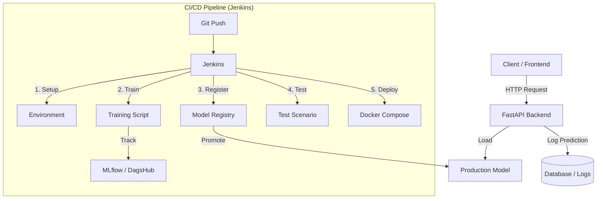

# 🕵️‍♂️ MLOps Fraud Detection System


Un système complet de détection de fraude de bout en bout, intégrant les meilleures pratiques MLOps : de l'entraînement des modèles au déploiement en production, en passant par le monitoring et l'intégration continue.

---

## 📋 Vue d'ensemble

Ce projet implémente une solution robuste pour la détection de transactions frauduleuses. Il ne s'agit pas seulement d'un modèle de Machine Learning, mais d'une **plateforme MLOps complète** conçue pour l'évolutivité et la maintenabilité.

### Fonctionnalités Clés

*   **⚡️ API d'Inférence Temps Réel** : Backend performant sous FastAPI.
*   **🖥️ Interface Utilisateur Intuitive** : Frontend Streamlit pour tester le modèle et visualiser les données.
*   **🔄 Pipeline CI/CD Automatisé** : Jenkins orchestre l'entraînement continu et le déploiement (CT/CD).
*   **🧪 Experiment Tracking** : Suivi rigoureux des métriques et paramètres via MLflow & DagsHub.
*   **📦 Model Registry** : Gestion des versions de modèles prêt pour la production.
*   **🐳 Conteneurisation** : Déploiement simplifié grâce à Docker et Docker Compose.

---

## 🏗️ Architecture

Le projet est structuré en plusieurs micro-services et composants clés :



## 📂 Structure du Projet

```text
Projects/MLOps/
├── backend/                 # API FastAPI
│   ├── src/                 # Code source API (api.py, preprocessing...)
│   └── Dockerfile           # Image Docker Backend
├── frontend/                # Interface Streamlit
│   └── Dockerfile           # Image Docker Frontend
├── Jenkins/                 # Configuration CI/CD
│   ├── Dockerfile           # Image Jenkins Custom (Python + Docker CLI)
│   ├── Jenkinsfile.txt      # Pipeline définition
│   ├── train_model.py       # Script d'entraînement continu
│   └── register_best_model.py # Script de registre de modèle
├── notebooks/               # Recherche & Développement
│   ├── data/                # Données brutes/traitées
│   ├── processors/          # Artefacts de préprocessing (Scalers, Encoders)
│   └── mlflow_tracking.ipynb # Notebook d'expérimentation
├── requirements.txt         # Dépendances globales
└── docker-compose.yml       # Orchestration des services
```

---

## 🚀 Installation et Démarrage

### Prérequis

*   **Docker** et **Docker Compose** installés.
*   Compte **DagsHub** (pour le tracking MLflow distant).

### 1. Clonage et Configuration

```bash
git clone <votre-repo>
cd MLOps

# Créer le fichier .env
cp .env.example .env
# Remplir les variables DAGSHUB_TOKEN, etc.
```

### 2. Démarrage Rapide (Application)

Pour lancer l'application complète (Backend + Frontend) :

```bash
docker compose up -d --build
```

*   **Frontend Check** : `http://localhost:8501`
*   **API Docs** : `http://localhost:8000/docs`

### 3. Démarrage du Pipeline CI/CD (Jenkins)

Pour lancer le serveur CI/CD :

```bash
cd Jenkins
docker build -t jenkins-mlops .
docker run -d -p 8080:8080 -p 50000:50000 \
  -v jenkins_home:/var/jenkins_home \
  -v /var/run/docker.sock:/var/run/docker.sock \
  --name jenkins-mlops jenkins-mlops
```

Accédez à Jenkins sur `http://localhost:8080`.

---

## ⚙️ Pipeline d'Entraînement Continu

Le pipeline Jenkins automatise le cycle de vie du modèle :

1.  **Preparation** : Installation des dépendances.
2.  **Training** : Entraînement de 4 modèles (RandomForest, XGBoost, LightGBM, CatBoost) sur les nouvelles données.
3.  **Evaluation** : Comparaison des modèles (ROC-AUC) via MLflow.
4.  **Registration** : Le meilleur modèle est tagué et enregistré.
5.  **Testing** : Validation du modèle sur un scénario de fraude spécifique.
6.  **Deployment** : Si les tests passent, l'application est redéployée avec le nouveau modèle.

---

## 🛠 Technologies Utilisées

*   **Langage** : Python 3.11
*   **ML Libraries** : Scikit-learn, XGBoost, LightGBM, CatBoost, Imbalanced-learn
*   **API Framework** : FastAPI, Pydantic
*   **Frontend** : Streamlit
*   **DevOps** : Docker, Jenkins
*   **MLOps** : MLflow, DagsHub

---

## 👥 Auteur

**Bassem Benhamed** - *MLOps Engineer*

Projet réalisé dans le cadre d'une mise en œuvre de pipeline MLOps complet.
